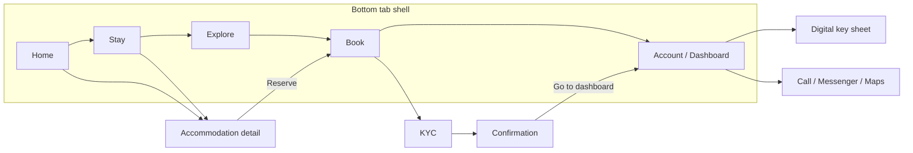
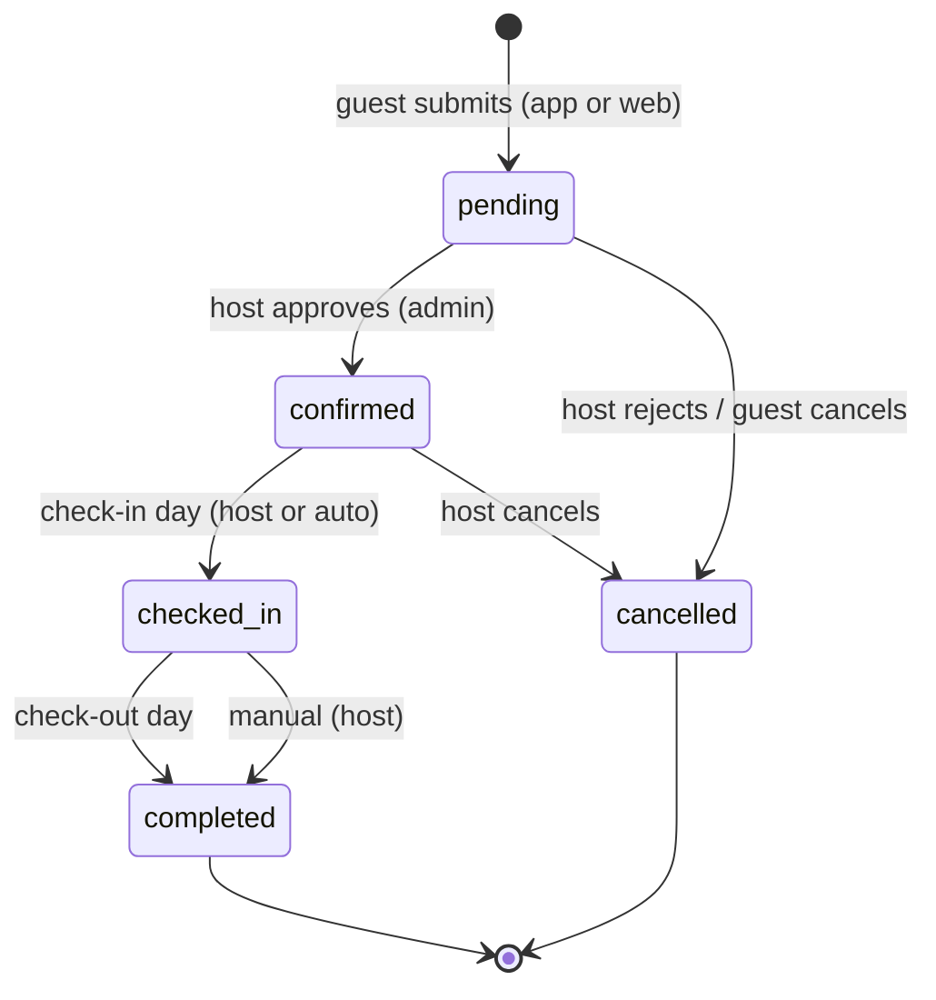

# Hacienda de LuisAna — Flutter App Proper Flow

**Scope:** Guest app end-to-end flow — navigation, booking lifecycle, KYC, digital key, error paths, and backend wiring.
**Principle:** *The host is the authority. The app mirrors server state — it never grants itself anything.*

> **✅ Demo flow implemented (Sep 2026)** — run `flutter pub get` first (new deps: `shared_preferences`, `crypto`).
>
> | Piece | Where | Behavior |
> |---|---|---|
> | Guest auth | `lib/services/auth_store.dart`, `lib/screens/auth_screen.dart` | Demo-local register/login (SHA-256, persisted session). Browsing stays open — the **auth wall appears only when submitting a booking** (or from the dashboard). |
> | Validation | `lib/utils/validators.dart` | Name/email/PH-phone/password + trip sanity (dates, capacity). Deliberately "good enough", not exhaustive. |
> | Honest pending → confirmed | `lib/services/booking_store.dart` | No more self-confirm or seed booking. Submit = `pending` → KYC `submitted` → **simulated host approval after ~6 s** → `confirmed` (stands in for the real /admin action in P2). |
> | Persistence | SharedPreferences | Accounts, session, and bookings survive restarts. |
> | Dashboard states | `lib/screens/dashboard_screen.dart` | Signed-out prompt, no-booking empty state, status timeline (Reserved → Verification → Confirmed → Check-in), cancel-while-pending, past stays, logout. Digital key unlocks only when confirmed. |
>
> Not in the demo (still future phases): real Firebase Auth/Firestore/Storage sync, live host approvals, real BLE key, date-window key gating.

---

## 1. Current flow (as built today) — and what's broken

```
Book tab (2-step form, pre-filled "Maria Santos")
  → creates Booking in memory (status: pending)
  → KycScreen (pick ID + receipt — local file names only)
  → on submit: store.confirm()   ← ❌ APP AUTO-CONFIRMS ITSELF
  → BookingConfirmationScreen
  → Dashboard (key works immediately)
```

| # | Problem | Consequence |
|---|---|---|
| 1 | `store.confirm()` on KYC submit | Guest is confirmed without host approval — the whole reservation pipeline is decorative |
| 2 | `BookingStore` is in-memory only | Booking vanishes on app restart |
| 3 | Demo seed booking (`HDL-9824`, status confirmed) in constructor | Fresh install shows a fake confirmed reservation; key "works" out of the box |
| 4 | Nothing is written to Firestore | Owner's `/admin` never sees app bookings — two parallel universes |
| 5 | KYC images are local paths | Host can never review ID / receipt |
| 6 | Ref ID `1000 + ms % 8999` | Collides; not traceable |
| 7 | Key gated only on `status == confirmed` | Works days before check-in, day of checkout, forever |
| 8 | Statuses `pending/confirmed/checkedIn` | Mismatch with web `Pending/Confirmed/Completed/Cancelled` |
| 9 | One booking slot, no history | Returning guest can't see past stays |
| 10 | No availability check | Guest can request dates that are already taken |

---

## 2. The Proper Flow — guest journey (happy path)

```mermaid
flowchart TD
    A[App launch] --> B{Booking on this device?}
    B -- no --> C[Home — browse mode]
    B -- yes --> D[Dashboard — upcoming stay]

    C --> E[Stay tab / detail]
    E --> F[Book tab — dates, guests, contact]
    F --> G{Dates available?}
    G -- no --> F
    G -- yes --> H[Review + estimate → Submit]
    H --> I[Firestore create\nstatus: pending · kyc_status: required]
    I --> J[KYC — capture / upload ID + receipt]
    J --> K[kyc_status: submitted]\nstatus stays pending
    K --> L[Confirmation screen\nWhat happens next?]
    L --> M[Dashboard — Awaiting confirmation]

    M --> N{Host reviews in /admin}
    N -- approve --> O[status: confirmed\npush notification 🎉]
    N -- reject --> P[status: cancelled\nreason + rebook CTA]
    O --> Q[Check-in day 14:00\nDigital key activates]
    Q --> R[Unlock / auto-relock ESP32]
    R --> S[Check-out day 12:00\nkey expires]
    S --> T[status: completed\nrate your stay]
```

**The one rule that changes everything:** after submit, every status the guest sees comes **from Firestore** (live subscription). The app renders state; it never mutates authority state.

---

## 3. Navigation map



- Tab 5 becomes **Account**: when no booking → sign-in / browse prompt + past stays; when booking → dashboard (status, key, host contact). No more fake welcome for strangers.
- Confirmation pushes `AppShell(initialTab: 4)` (already correct — keep).

---

## 4. Booking status state machine (unified, web + app)

One vocabulary everywhere. Web `/admin` buttons already map 1:1.



**KYC is a separate axis** (a confirmed booking with rejected KYC shouldn't read "cancelled"):

```
kyc_status: required → submitted → approved | rejected → (resubmit) → submitted
```

| Field | Type | Set by |
|---|---|---|
| `status` | `pending · confirmed · checked_in · completed · cancelled` | host only (guest may set `cancelled` while `pending`) |
| `kyc_status` | `required · submitted · approved · rejected` | app sets `submitted`; host sets `approved`/`rejected` |

---

## 5. Screen-by-screen contract

| Screen | Shows | Primary action | Exits | Empty / error state |
|---|---|---|---|---|
| **Home** | Hero, stats, featured stays | Book / Call / Directions | detail, tabs | — |
| **Stay** | Filter chips, cards, rates | Reserve (preselect) | detail → Book | — |
| **Explore** | Nearby, gallery | Open in Maps | photo viewer | — |
| **Book (step 1)** | Accommodation, dates, guests | Validate: checkout > checkin, guests ≤ capacity, dates free | step 2 | Conflict → "Dates taken, nearest free: …" |
| **Book (step 2)** | Name, phone, email, notes, estimate | **Submit → Firestore** | KYC | Offline → queue + banner |
| **KYC** | ID + receipt upload with preview | Submit → Storage upload + `kyc_status: submitted` | Confirmation | Upload fail → retry per-file |
| **Confirmation** | Ref ID (copyable), summary, "host confirms within 24h" | Go to dashboard | Account tab | — |
| **Account/Dashboard** | Live status card, timeline, actions | Refresh (auto via stream) | Key sheet, call, cancel, rebook | No booking → "No upcoming stay" |
| **Digital key sheet** | Lock state, battery, window countdown | Press-and-hold unlock (1.2 s) | — | Disabled states below |

**Digital key gating — all must be true:**

```
enabled = status == 'confirmed' or 'checked_in'
       and kyc_status == 'approved'
       and now >= check_in + 14:00
       and now <  check_out + 12:00
```

Disabled reason is always shown ("Key activates Fri 2:00 PM", "ID verification pending", …). Auto-relock 5 s stays.

---

## 6. Data & backend contract

App writes the **same** `bookings` collection the web form uses — admin sees app bookings with zero admin changes.

```jsonc
// bookings/{id}
{
  "ref_id": "HDL-260906-K4TQ",        // YYMMDD + 4 random chars, collision-safe
  "guest_name": "...", "phone": "...", "email": "...",
  "check_in": "2026-09-12", "check_out": "2026-09-14",   // ISO dates, same as web
  "guests": 4, "accommodation": "main_house",             // web's slug ids
  "notes": "...",
  "status": "pending", "kyc_status": "required",
  "kyc_id_url": "gs://…/kyc/{uid}/id.jpg",                // Storage, set on submit
  "kyc_receipt_url": "gs://…/kyc/{uid}/receipt.jpg",
  "uid": "anonymous-auth-uid",                            // guest identity
  "created_at": "…", "source": "flutter_app"
}
```

**Rules changes** (current rules already cover most of this):

```js
match /bookings/{id} {
  allow create: if true && request.resource.data.status == 'pending';  // unchanged
  allow read:   if isOwner() || (isSignedIn() && resource.data.uid == request.auth.token.uid);
  allow update: if isOwner()                                    // host only
             || (isSignedIn() && resource.data.uid == request.auth.token.uid
                 && request.resource.data.diff(resource.data).affectedKeys().hasOnly(['status','kyc_status','kyc_id_url','kyc_receipt_url'])
                 && resource.data.status == 'pending'            // guest may only:
                 && request.resource.data.status in ['pending','cancelled']); // cancel self / attach kyc
}
```

- **Guest identity:** anonymous Firebase Auth at first launch (no login friction). Upgrade path: phone auth later, linking past `uid`s.
- **Local cache:** `shared_preferences` mirrors the booking list (ref IDs + snapshot) so the app opens instantly and survives restarts; Firestore stream reconciles.
- **Availability:** before submit, query non-cancelled bookings overlapping the range (needs the composite index in `firestore.indexes.json`).

---

## 7. Edge cases the flow must own

| Case | Behavior |
|---|---|
| Offline submit | Queue locally, banner "will send", send on reconnect; never fake success |
| Host rejects KYC after confirming | Status stays `confirmed`, key stays disabled, banner: "Re-upload valid ID" |
| Guest cancels after confirm | Ask to call host (rules already block self-cancel past `pending`) |
| App reinstall / new device | Enter ref ID + phone → lookup → re-attach to anonymous uid |
| Double-tap submit | Idempotency: disable button + ref generated server-side-friendly single write |
| ESP32 unreachable | Key sheet shows "Walk to the door / call host" after 10 s timeout — never a silent failure |
| Late checkout | Host flips `check_out` — key expiry follows automatically since gate is date-driven |

---

## 8. Implementation phases

| Phase | Deliverable | Effort |
|---|---|---|
| **P1 — Local correctness** (no backend) | Remove seed booking + auto-confirm; persist to `shared_preferences`; unified status enum; key gate by date window; ref ID format; booking history list; empty states | ~1–2 days |
| **P2 — Firestore sync** | `cloud_firestore` + anonymous auth; create/read-own bookings; live status on dashboard; admin sees app bookings | ~2–3 days |
| **P3 — Real KYC** | `firebase_storage` uploads; `kyc_status` loop; reject/resubmit UI; KYC review row in web `/admin` | ~2–3 days |
| **P4 — Real ESP32** | Replace `Esp32Service` simulation with `flutter_blue_plus` + challenge-response (key = signed token, not just BLE proximity) | ~1 week + hardware |

P1 can ship immediately and makes the prototype honest; P2 is the one that connects guest → host → key as one pipeline.

---

## 9. What stays as-is

- 5-tab shell, theme, quiet-luxury styling, `AppTheme` palette
- Stay/Explore/Home content and detail screens
- Simulated ESP32 timing (800 ms unlock, 5 s relock, 1.2 s hold) — P4 swaps the transport only
- Web `/admin` — needs only the KYC review row (P3) and the email allowlist uncommented
