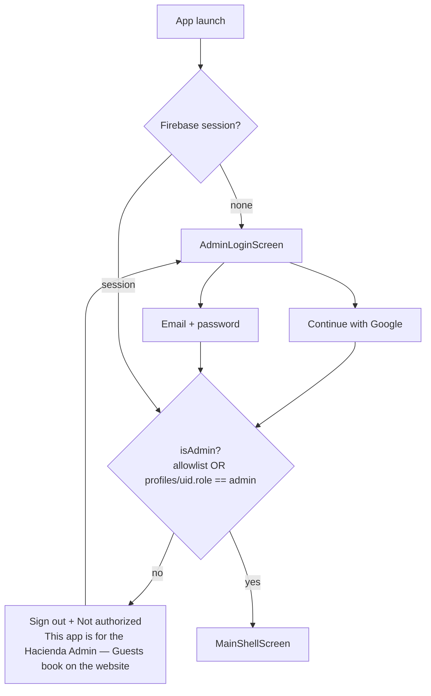
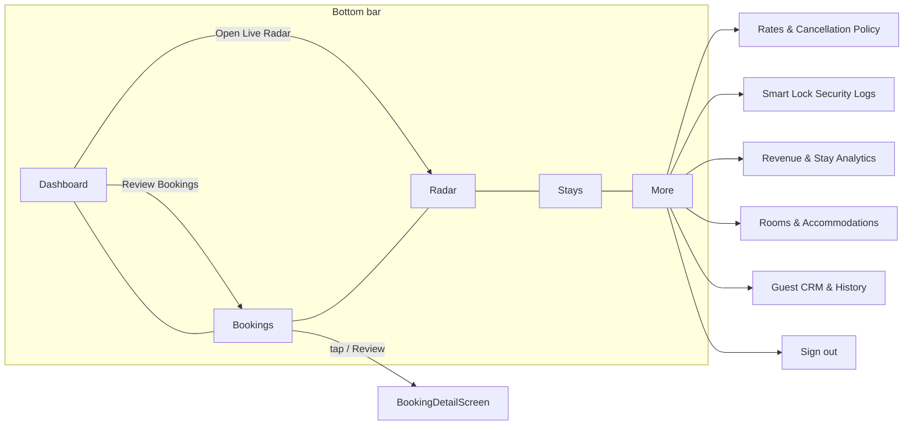
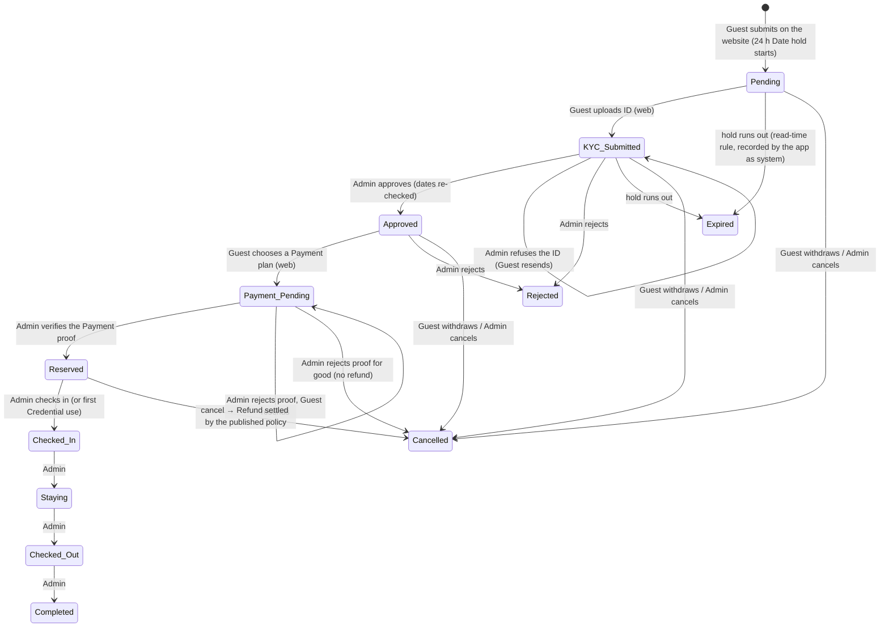

# Hacienda de LuisAna — Admin app flow

**Scope:** the Flutter mobile app (`lib/`) end to end — sign-in gate, navigation, the Booking lifecycle as the Admin drives it, KYC and payment review, refunds, published rates, and the backend contract it shares with the Guest website.
**Principle:** *One lifecycle, two sides.* The Guest takes their actions on the website (`src/lib/booking`), the Admin takes theirs here (`lib/services/booking_lifecycle.dart`), and `firestore.rules` is the arbiter both must satisfy. The app never writes a status past the rules. (ADR-0007)

> **Status (Sep 2026):** implemented as described below. The former guest-prototype screens (booking form, KYC capture, digital key, simulated ESP32) were removed from `lib/`; Guests use the website.

---

## 1. Sign-in gate



- `AuthStore` (`lib/services/auth_store.dart`) holds the session. `isAdmin` is the only authorization question the app asks.
- The allowlist `AuthStore.kAdminEmails` mirrors `adminEmails()` in `firestore.rules`, `isAdminEmail()` in `storage.rules` and `BOOTSTRAP_ROLES` in `src/lib/auth/profile.ts`. A second operator is added by allowlist or by a `profiles/{uid}` document with `role: 'admin'` — never by a new role.
- Without Firebase configured the gate cannot be passed; the screens behind it run on in-memory demo data for development.

---

## 2. Navigation map



`MainShellScreen` keeps every tab in an `IndexedStack`; the Bookings tab badge counts Pending requests and the Radar tab dot lights when a Guest is within 5 km.

---

## 3. Booking lifecycle (shared vocabulary)

Canonical statuses (CONTEXT.md § Booking status), the same strings on both sides:

```
Pending → KYC Submitted → Approved → Payment Pending → (Payment Verified) → Reserved
        → Checked-In → Staying → Checked-Out → Completed
terminal branches: Rejected · Cancelled · Expired
```



**Who takes which action**

| Action | Actor | Where |
| --- | --- | --- |
| Submit, UploadKyc, ChoosePaymentPlan, UploadPaymentProof, Cancel (own) | Guest | website |
| Approve, Reject, RejectKyc, VerifyPayment, RejectPaymentProof, Cancel (any), MarkRefunded, PurgeKyc, RevokeKey | Admin | **this app** |
| CheckIn, BeginStay, CheckOut, Complete | Admin (or system on the lock's first Credential use) | **this app** |
| Expire | system — the app records it when it sees a hold has run out | **this app** |

Every accepted action writes one Activity entry (`bookings/{id}/activity/{seq}`) with `actor`, `actor_id`, `from_status`, `to_status`, `at` and `reason`. `applyBookingAction` writes the patch and the entry in one Firestore batch, so a transition is never unlogged.

**Preconditions the app enforces** (`applyAdminAction` in `booking_lifecycle.dart`):

- Approve needs `kyc_status == submitted`, and re-checks the dates against every other *committed* Booking for the Accommodation (ADR-0003); conflicts are named in the refusal.
- Reject / RejectKyc / RejectPaymentProof need a reason — the Guest reads it.
- VerifyPayment needs a Payment proof and an amount that covers `amount_due + security_deposit`; it lands on Reserved in one move.
- Cancel from Reserved settles the Refund from the Booking's figures and the published policy (tiers by days before check-in, deposit percentage, damage deduction) and records `refund_status: initiated` with the breakdown; MarkRefunded closes it.
- Any action on a Booking whose recorded Date hold has run out is refused: it reads as Expired.
- Nothing leaves Completed / Rejected / Cancelled / Expired. PurgeKyc clears the ID and receipt URLs after a stay (RA 10173); RevokeKey logs a Credential revocation without moving the Booking.

---

## 4. Screen-by-screen contract

| Screen | Shows | Primary actions | Empty / error state |
| --- | --- | --- | --- |
| **AdminLoginScreen** | Google button with the Admin address, email + password | Sign in → `requireAdmin()` | Not authorized → signed out with the reason |
| **Dashboard** | Today's check-ins, active stays, pending requests, revenue, recent lock events, approaching-Guest banner | Review Bookings, Open Live Radar | Metrics at zero |
| **Bookings** | Every Booking, newest first; filters All / Needs action / Pending / Reserved / Active Stay / Completed / Cancelled; per card: exact status, next step, Date hold countdown | Review → detail; one-tap Approve / Check in / Begin stay / Check out / Complete; call / SMS | "No bookings found" |
| **Booking detail** | Guest, dates, notes, submission time, Date hold; KYC status + ID / receipt links + refusal reason; payment plan, totals, proof link, verified amount; refund breakdown; **the actions the current status allows**; Activity log | Every lifecycle action with its dialog (reason, amount, damage deduction, resend-or-cancel) | "Nothing to do — X is a final status"; expired-hold banner with **Record** |
| **Radar** | Live Guest locations from `tracking_sessions`, distance and ETA to the resort | Call / SMS, map | No active sessions |
| **Stays** | Stay durations, progress, days remaining | — | No stays |
| **Analytics** | Confirmed vs projected revenue, conversion, average length of stay, duration buckets, top Accommodation | — | Zeros |
| **Smart lock** | `access_logs` newest first, per-door filter, simulator | Record an event | No events |
| **Rooms** | Accommodation status and nightly price | Mark available / occupied, edit price | "Publish rates first" |
| **CRM** | Guest history, VIP badges, notes | — | No profiles |
| **Rates** | The live `site_config/rates` version; editors for each Accommodation (nightly rate, Security deposit, down-payment %) and the refund policy (flat %, deposit %, tiers) | **Publish to website** (validated first; problems listed inline) | "Nothing published yet" |

---

## 5. Data & backend contract

The app reads and writes the **same** Firestore documents the website does.

```jsonc
// bookings/{id} — created by the website, driven by both sides
{
  "ref_id": "HDL-260906-K4TQ",
  "uid": "guest-anonymous-uid",            // the Guest's identity (ADR-0004)
  "source": "web",
  "guest_name": "…", "phone": "…", "email": "…",
  "accommodation": "main-house",           // src/config/site.ts id
  "check_in": "2026-09-12", "check_out": "2026-09-14",
  "guests": 4, "special_requests": "…",
  "status": "KYC Submitted",               // canonical string
  "hold_expires_at": "2026-09-07T10:00:00.000Z",
  "kyc_status": "submitted", "kyc_id_url": "https://…", "kyc_receipt_url": "https://…", "kyc_reject_reason": null,
  "payment_plan": "down-payment", "payment_status": "pending", "payment_proof_url": "https://…",
  "amount_claimed": 5500, "stay_total": 11000, "amount_due": 5500, "security_deposit": 500, "balance_due": 5500,
  "amount_verified": 6000,
  "policy_version": "v2026-09", "policy_effective_date": "2026-09-01",
  "refund_status": "none", "refund_total": 0, "refund_breakdown": null,
  "rejection_reason": null, "cancellation_reason": null,
  "created_at": <Timestamp>
}
```

| Collection | App reads | App writes | Rule |
| --- | --- | --- | --- |
| `bookings` | all, ordered by `created_at` | patches from `applyBookingAction`; delete | Admin: update within the terminal / KYC / payment guards; delete |
| `bookings/{id}/activity` | oldest first | one entry per action, id = `seq` | append-only; `actor` must be the writer's role (`system` allowed for the Admin) |
| `site_config/rates` | live | `publishRates` (validated) | public read, Admin write |
| `tracking_sessions` | all | — | Admin read; created / deleted by the Guest's device |
| `access_logs` | all | simulator events | Admin read / correct |
| `rooms`, `guest_profiles` | all | status, price | Admin |
| `profiles/{uid}` | own (role check) | — | own read; Admin may write anybody's role |

Model mapping lives in `lib/models/booking_model.dart`: `rawStatus` keeps the exact status, `status` buckets it into five stages for filters and KPIs, and `toLifecycleDoc()` hands the rules the stored document. `BookingModel.accommodationLabel` turns the website's ids into names.

---

## 6. Edge cases the app owns

| Case | Behavior |
| --- | --- |
| Hold ran out before review | Detail shows the expired banner; **Record** writes `Expired` as `system`. Every other action on it is refused. |
| Two Bookings want the same single unit | Approve of the second is refused with the conflicting Booking named; the Admin picks (ADR-0003). |
| Guest sent the wrong proof | Reject proof → *let them resend* keeps Payment Pending and clears the URL; *cancel* ends the Booking with `refund_status: none`. |
| Cancel after money was verified | Refund settled by the stamped policy version; `refund_breakdown` stored; MarkRefunded once the money is back. |
| Firestore write fails | The action's dialog shows the Firestore error; nothing is patched locally in cloud mode. |
| No Firebase (dev) | In-memory demo data; actions patch the list and a local Activity log so the flow can be exercised. |
| Non-Admin account signs in | Signed out immediately with "Not authorized". |

---

## 7. What is deliberately not here

- No Guest screens: booking form, KYC capture, Mobile Key UI. Those belong to the website (`src/`).
- No Staff or Host role, no role switcher, no team screen (ADR-0007).
- No scheduled hold sweep: expiry is a read-time rule (ADR-0002); the app only records what it reads.
